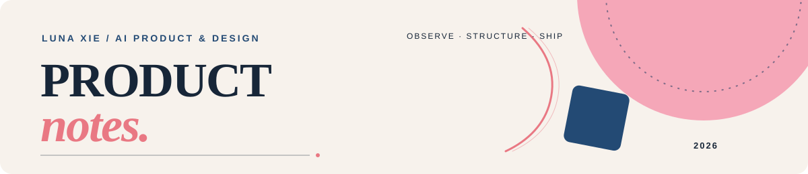
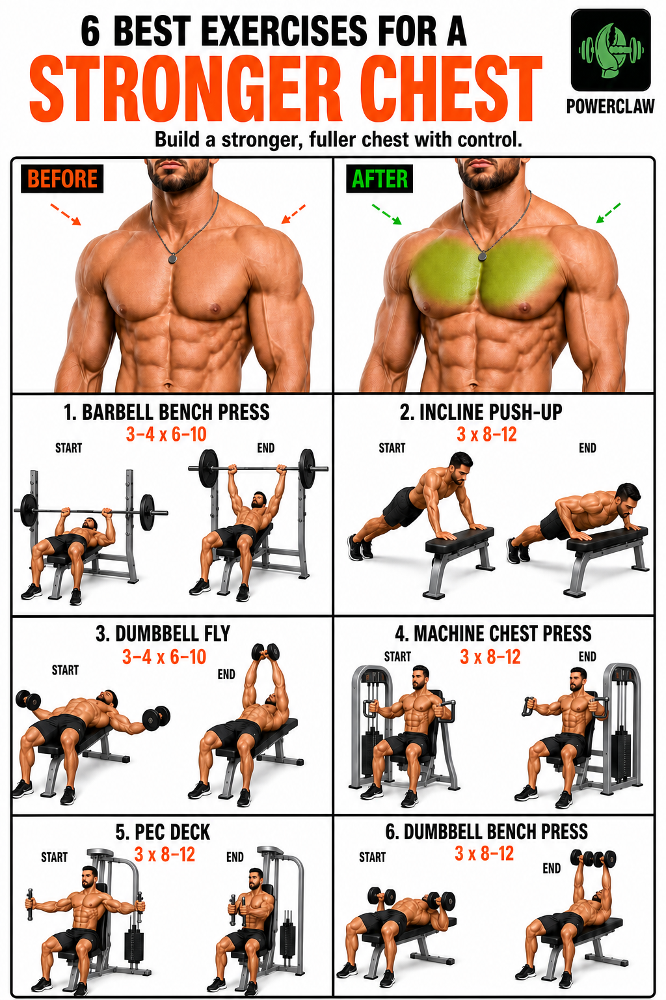
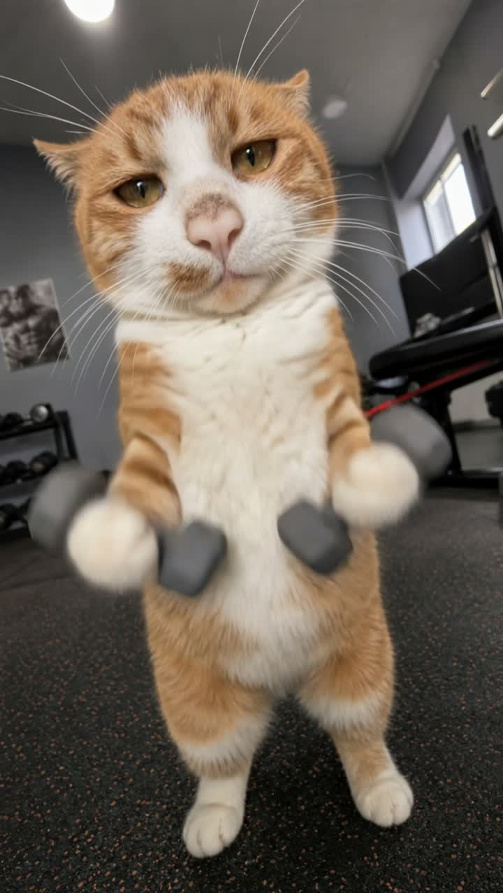

<div align="center">



# 谢诗扬 · Luna Xie 👋

### AI 产品经理｜设计背景｜多模态 AI / 产品设计 / 内容策略

我从设计出发，做多模态 AI 产品、用户体验与内容策略。

<a href="https://luna-xie-portfolio.ccxxii001212.chatgpt.site/">↗ 打开我的个人作品集</a>
&nbsp;&nbsp;·&nbsp;&nbsp;
<a href="https://artioo.cn/">Artioo 多模态平台</a>
&nbsp;&nbsp;·&nbsp;&nbsp;
<a href="https://mp.weixin.qq.com/s/6WoXMmKvK2pIP0ELTINeWw">Artioo 视频展示</a>
&nbsp;&nbsp;·&nbsp;&nbsp;
<a href="https://kv.ccxixi.top/">D-Design AI 生图工作台</a>

</div>

---

> **我的产品笔记：先把问题问清楚，再把复杂的事情变简单。**  
> 我关注的不是“模型能生成什么”，而是“人能不能理解、使用，并且相信它”。

## About Me

你好，我是 Luna，一名有设计背景的 AI 产品经理，目前在华中科技大学攻读设计学硕士。

我喜欢把模型能力、用户需求和业务流程放在同一张图里思考：先拆解问题，再设计流程、规则和评测方式，最后把想法落成可以被使用、被讨论、被迭代的产品。

我现在主要关注：

| 方向 | 我在做什么 |
| --- | --- |
| **多模态 AI** | 组织图像、视频与文本能力，让创作意图更稳定地被理解和执行 |
| **AI 产品设计** | 把模型能力放进真实工作流，设计入口、状态、约束与反馈 |
| **知识库问答** | 让 AI 的答案有依据，并把引用、拒答和转人工设计清楚 |
| **内容策略** | 用内容结构、用户洞察和数据观察，把一次灵感变成可复用的方法 |

## Selected Projects / 代表项目

### 01｜让 AI 视频，从能生成到能制作

参与 **Artioo 企业级多模态 AI 创意生产平台**的能力研究与产品评测，围绕人物、空间、视觉风格和专业运镜等任务，对比 Seedance、Kling、Runway、Veo 四款模型；设计 8 类任务、重复生成 3 次，累计复盘 **96 条视频**，建立 6 项评测指标，归纳 Badcase 并沉淀模型选择与工作流优化建议。

→ [访问 Artioo](https://artioo.cn/)&nbsp;&nbsp;·&nbsp;&nbsp;[观看视频展示](https://mp.weixin.qq.com/s/6WoXMmKvK2pIP0ELTINeWw)&nbsp;&nbsp;·&nbsp;&nbsp;[查看个人作品集](https://luna-xie-portfolio.ccxxii001212.chatgpt.site/#work)

### 02｜让 AI 生图，成为顺手的创作工具

企业级 AI 营销物料创作工作台。围绕“预设创作 / 自由创作 / 项目管理”重新梳理入口和路径，把生图能力放进真实的设计工作流；同时通过 Prompt 约束和质检规则控制文字、价格、Logo 与版式风险。

→ [体验 D-Design AI 生图工作台](https://kv.ccxixi.top/)&nbsp;&nbsp;·&nbsp;&nbsp;[阅读完整案例](https://luna-xie-portfolio.ccxxii001212.chatgpt.site/#d-design)

### 03｜让答案有依据，也知道何时停下来

参与滴滴 HR-RAG 智能助手设计，梳理政策入库、语义检索、混合检索、Rerank、答案生成与来源引用链路；参与父子分块、Prompt 约束、测评集，以及“资料不足时拒答 / 高风险问题转人工”的边界设计。

→ [打开 HR-RAG 项目主页](https://xiesy0229.github.io/hr-rag-assistant/)&nbsp;&nbsp;·&nbsp;&nbsp;[阅读 RAG 学习手册](https://xiesy0229.github.io/hr-rag-assistant/docs/rag-learning-handbook.html)&nbsp;&nbsp;·&nbsp;&nbsp;[查看合规审核工作流](https://github.com/Xiesy0229/hr-rag-assistant/blob/main/docs/compliance-review-workflow.md)

### 04｜把内容策略，变成可以迭代的工作流

围绕海外健身 App，整理 **356 项健身动作**，分析 **200+ 条 TikTok / YouTube 内容**，建立 3 类 AIGC 内容场景与日更生成工作流；沉淀内容分类、平台观察、A/B Test 与复盘方法。

阶段成果：形成动作库教学、动作合集与萌宠 IP 等内容方向的表现分析，并将选题、生成、质检、发布和复盘整理成可复用的内容策略工作流。

<p align="center">
  
  
</p>

→ [查看 AI 内容工作流](https://github.com/Xiesy0229/daily-fitness-illustration-workflow)&nbsp;&nbsp;·&nbsp;&nbsp;[打开完整复盘](https://github.com/Xiesy0229/daily-fitness-illustration-workflow/blob/main/case-studies/README.md)

<details>
<summary><strong>更多项目 / More work</strong></summary>

### 05｜让每一次审核，都有清楚的下一步

围绕供应商“资料提交—资质审核—通过 / 驳回—重新提交”链路，完成需求分析、状态流转、规则预审、人工复核、PRD、交互原型与验收标准设计，并围绕履约质量参与供应商信用策略设计。

→ [查看 PRD 与原型作品集](https://github.com/Xiesy0229/prd-portfolio-public)

### 06｜让一次训练，串成一套服务

**Triple 健身服务三端系统**：围绕会员小程序端、教练工作端和运营管理后台，梳理预约、签到核销、会员卡、训练成长、内容社区、商城交易与经营数据等模块，把一次训练服务拆成可协作的产品体系。

→ [打开 Triple 项目主页](https://xiesy0229.github.io/triple-product-system/)&nbsp;&nbsp;·&nbsp;&nbsp;[查看代码与交互原型](https://github.com/Xiesy0229/triple-product-system)

</details>

## My Product Practice / 我的工作方式

```text
观察真实问题  →  拆解任务与约束  →  设计可用流程  →  用评测和数据复盘
     用户              产品                体验                证据
```

我习惯从用户、业务和模型三个视角同时看问题：把模糊需求变成可以讨论的任务，再把任务落成流程、原型、规则和可验证的结果。

## Toolbox / 工具箱

`PRD` `User Flow` `Figma` `AI 评测` `Prompt 设计` `RAG` `A/B Test` `数据看板`  
`ChatGPT` `Claude Code` `Cursor` `Kling` `Seedance`

## Education & Experience / 教育与经历

- **华中科技大学｜设计学硕士在读**　2025.09—2028.06
- **华中科技大学｜环境设计学士**　2021.09—2025.12
- **滴滴 ABC 软件技术中心｜AI 产品实习生**　2026.03—2026.08
- **上海沃行信息技术有限公司｜AI 产品经理**　2026.02—2026.05
- **IELTS 7.0**

## 继续认识我

我希望继续做多模态 AI 产品、产品设计、用户体验和内容策略相关的事情：既理解人的需求，也愿意走进模型、数据和具体业务，把一个想法推进到真正可用。

<div align="center">

---

**A sense of art. A mind for product.**

如果你也在思考，如何让复杂的 AI 变得更清楚、更好用，欢迎来聊聊。

<a href="https://luna-xie-portfolio.ccxxii001212.chatgpt.site/">打开我的个人作品集 ↗</a>

</div>
